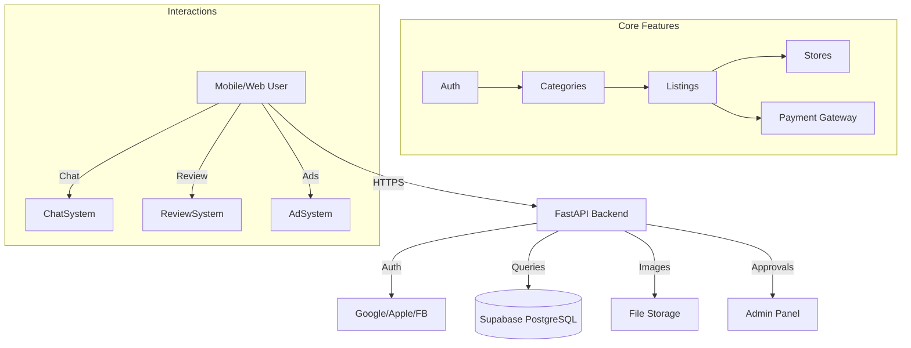
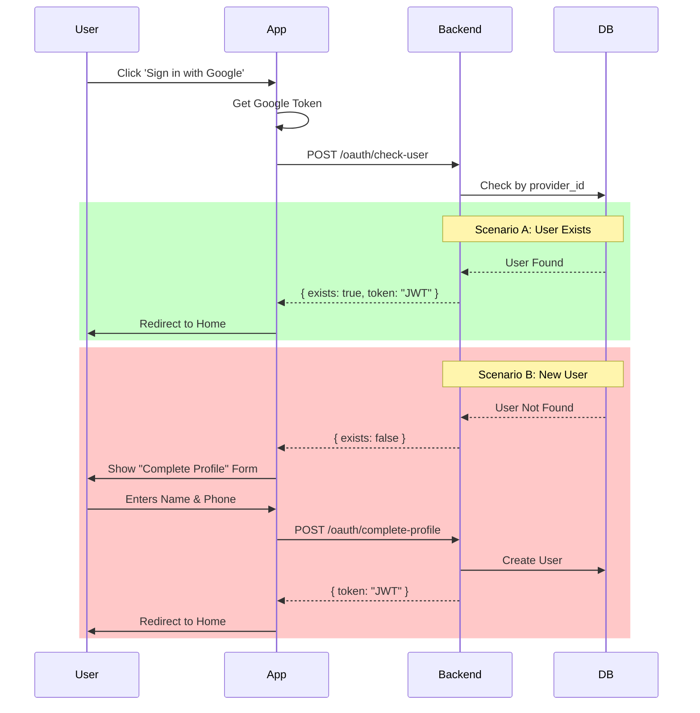
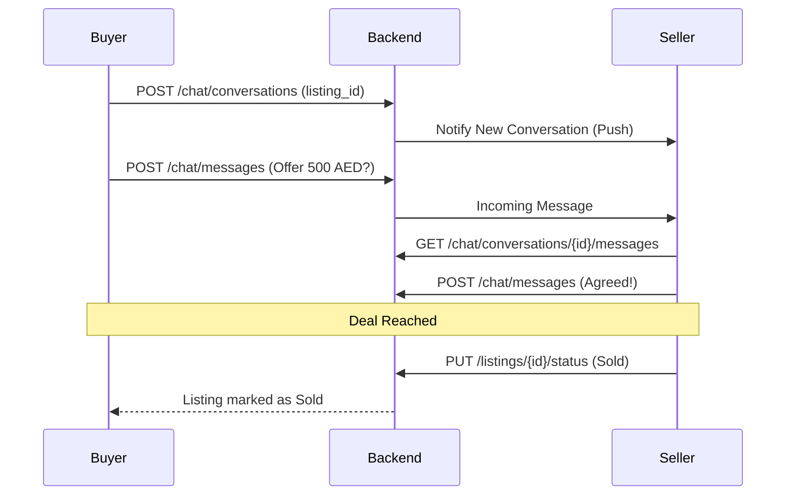
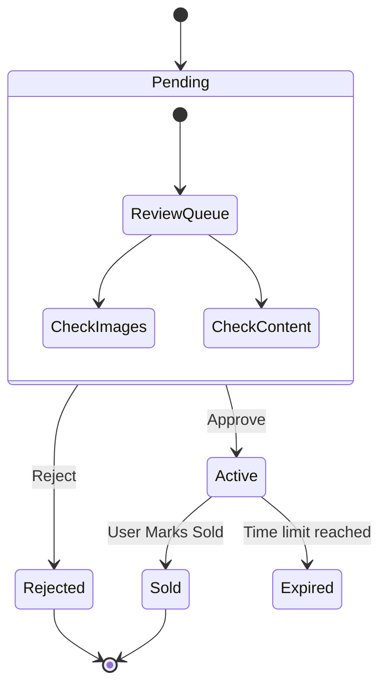

# 96sooq Flowcharts

## 1. Overall System Architecture



## 2. Authentication Flow (Two-Step Social Login)



## 3. Listing Creation & Payment Flow

```mermaid
flowchart TD
    Start[User Clicks 'Sell'] --> SelectCat[Select Category]
    SelectCat --> LeafCheck{Is Leaf?}
    LeafCheck -- No --> SelectSub[Select Sub-Category] --> LeafCheck
    LeafCheck -- Yes --> FetchSchema[Fetch Attributes Schema]
    FetchSchema --> BuildForm[Build Dynamic Form]
    BuildForm --> UserFill[User Fills Details]
    UserFill --> CheckCount[Check User Listing Count]
    
    CheckCount -- First Listing --> Free[Free Post]
    CheckCount -- 2nd+ Listing --> PickPlan[Show Pricing Plans]
    
    PickPlan --> UserPays[User Pays]
    UserPays -->|Success| SubmitPaid[Submit with plan_id]
    Free --> SubmitFree[Submit with plan_id=null]
    
    SubmitPaid --> DBInsert
    SubmitFree --> DBInsert
    
    DBInsert[Insert Listing to DB] --> SetStatus[Status = pending_approval]
    SetStatus --> AdminQueue[Admin Moderation Queue]
    
    AdminQueue -->|Admin Approves| Active[Active (Visible)]
    AdminQueue -->|Admin Rejects| Rejected[Rejected (Hidden)]
```

## 4. Chat & Negotiation Flow



## 5. Admin Moderation Flow


